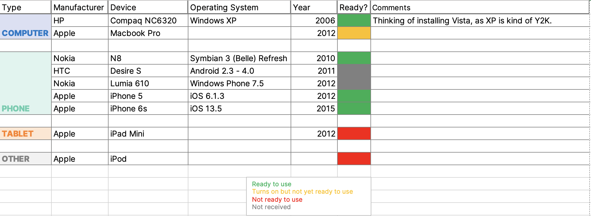

# 1st Methodology Design

The original methodology was putting a device in front of people and asking them to use and interact with the UI, while explaining what they're doing and feeling to me at the same time. The definitive methodology will be almost identical.

I want to understand ordinary people's views and opinions on user interfaces on computers and smartphones, especially skeuomorphism, and what can we learn from that period of time.

I will conduct interviews with people (composed of friends and family) of all ages.

Talking with my night colleague at IKEA where I work part time, she mentioned that I could ask HR for a spare room in the Aubonne building where I can do my user tests with people from IKEA on a week day. While this idea sounds genius because of the number of people I can interview, I need to have a reward for people to be motivated to participate in my user tests. (Drinks? Chips? An IKEA accessory? 😭)

## The User Test Procedure
The procedure doesn't need to happen in two phases like the initial tests were happening (Skeuomorphic Phase & Modern/Flat Design Phase), because I believe we currently are the latter phase and repeating stuff or showing things that they could see by pulling their phones out is not that interesting.

Different devices are positioned on a table, and users can chose which one to pick. They will have to try them all.

Each device has its own experience in itself, so here are questions I'm going to ask people while they use the device they chose:
- Did you own such device?
- Do you remember if user interfaces made you feel in a certain way?
- What do you like about these interfaces? And what don't you like?

Of course, I will ask other questions going with the flow and reactions of the users.

This will be a multi-devices experience, so minimum time would be 5 minutes and maximum 15 when I'm not constrained by time.

### The Devices

## Notes
If I'm interested in that subject, there is something that's interesting.
I have to make a distinction, how I talk about it, how I theorize it.
It's an exploratory approach, but at some point I can test a hypothesis.
Bring in something on the theme of nostalgia, 
What's the profile of the people, the sampling (semester 1) - snowball sampling.
Interesting to have people over 60 and under 30, for example, instead of all ages, so that results can be sharper (people who used these devices and people who didn't).
Affordance Theory.

TIME TO READ!
And the methodology will probably change and get better :)