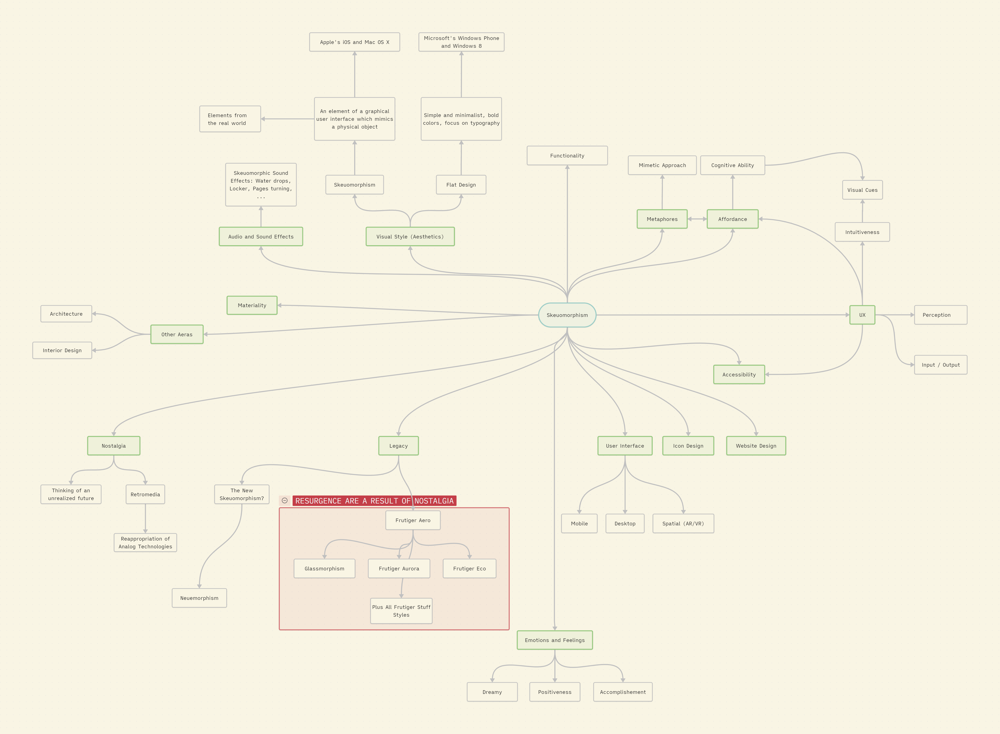

# Pulled Themes
Here is a list of themes I pulled from the Obsidian Methodology Canvas

- **Materiality**
 - Retromedia
 - Physicality of user interfaces
 - Physicality of media?
 
- **Accessibility**
 - Affordances
 - UX
 - Metaphors
 
- **Emotions and Feelings**
 - Nostalgia
 - “It reflects a sort of skepticism towards late stage capitalism and a longing for an unrealized future” — @trytogoback ([TikTok](https://www.tiktok.com/@trytogoback/video/7360407006890429742))

- **Visual Style (Aesthetics)**
 - The Skeuomorphism spectrum (Apple's Skeuomorphic Design Language and the industry.)

- **Legacy**
 - Frutiger Aero style and all subgenres.
 - The future of user interfaces, in VR and AR for example. Or in general, what's after? What's next?