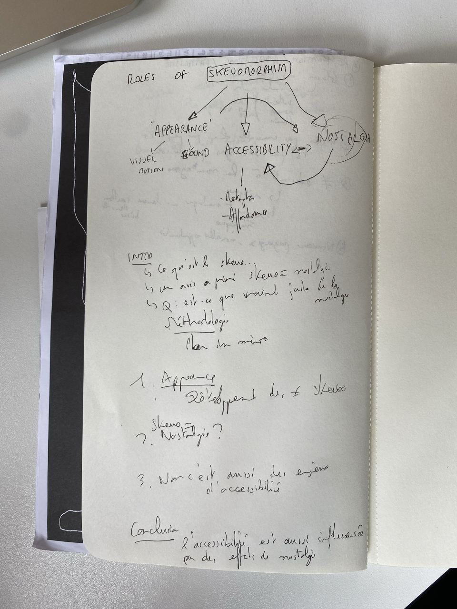

# Feedback from Nicolas Nova

I need to redo that canvas, in a "compact" way, by reuniting and reviewing all of the themes. It will help better organising all of these themes in my head first, before writing.

The goal is most importantly to find how all these references, interview outputs and data can be connected one on top of the other, without creating tensions.

Here's a sketch of what Nicolas drew on his notebook (maybe I should start doing that). I was amazed by how he mapped words and already had a writing plan in a few minutes (ofc just to show me an example), but I learned how to think of all this.

Next is that I need to prepare for the presentation of next week, **having a plan is key.**