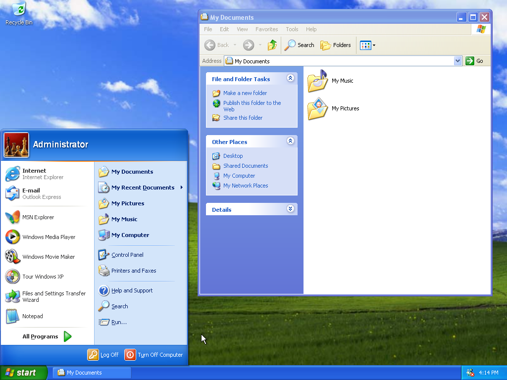
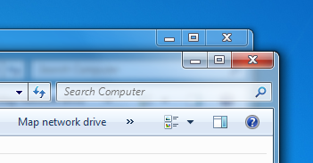

# Preface
I've always been curious and interested of graphical user interfaces. I find it fascinating designing interfaces that are the point of contact and connection of humans with their machines.

# Introduction

## A Dictionary
GUI: Graphical User Interface
UI: User Interface
UX: User Experience
GPU: Graphical Processing Unit
OEM: Original Equipment Manufacturer
OS: Operating System

## What is Skeuomorphism?
Way before screens, Skeuomorphism traces its roots from material objects and artistic movements like Art Nouveau, but it was only quoted on computers starting from the 1980s. Skeuomorphism is considered to be the use of metaphors of real life to mimic the real-world objects represented. One of the most common example that is always given is "the iPhone's old visual interface".

## Research Question
It's with that fascination into user interfaces that I wanted to revisit Skeuomorphism, maybe out of Nostalgia, but more importantly investigate the emotions of people who used these interfaces and what they think of them now. I'm also thinking about the future, as we're recently seeing a return to three dimension styling to user interfaces. So, how does the evolution of skeuomorphism influence our perception of graphical interfaces, and what role does accessibility and nostalgia play in the way we consider and design these interfaces?

# Context
## A small bit of History
In a small research lab down in Palo Alto, was an all-in-one desktop computer prototype that amazed anyone who had the chance to see it. The few who had the chance to meet this machine, took the main idea and ran with it to create a new generation of personal computers.
That computer was the Xerox Alto, imagined at Xerox's PARC, and considered by many the first computer to feature a GUI, a Graphical User Interface, that almost turned the world upside down.
Using common language, the portrait monitor displays text, small icons and allowed the use of multiple programs at the same time, in what was called the Desktop, just like the one at work, with items on it. The Alto is the first computer to use a WYSIWYG, What You See Is What You Get, text editor and bitmap display, meaning that you could print exactly what was displayed on the screen. Steve Jobs and Bill Gates both went to see this marvel and went on to copy the idea for their respective software, with Apple unveiling the Lisa in 1983 and the Macintosh in 1984. As for Microsoft, the first version of the Windows OS, operating system, was announced in 1983 as a GUI add-on for MS-DOS, but later came out as a standalone OS in 1985 and was licensed by PC manufacturers, mainly IBM.

In 1988, Apple filed a lawsuit against Microsoft and Hewlett-Packard for using visual GUI elements similar to Apple's Lisa and Macintosh OSs. Seeing this lawsuit, Xerox also filed one against Apple alleging that the Macintosh's GUI was heavily based on the Xerox Alto's OS.
After 4 years and an unsuccessful appeal to the Supreme Court, the United States Court of Appeals for the Ninth Circuit dismissed. Claiming that "Apple cannot get patent-like protection for the idea of a graphical user interface, or the idea of a desktop metaphor which concededly came from Xerox. It can, and did, put those ideas together creatively with animation, overlapping windows, and well-designed icons; but it licensed the visual displays which resulted."

From that point on, GUIs kind of became open-source, in a way that nobody could copyright the famous desktop metaphor. This led to the popularisation of personal computers and the internet coming at the same time.

At the 2000 Macworld Conference and Expo in San Francisco, Steve Jobs announced a complete reengineering and redesign of MacOS calling it MacOS X (or 10). A new base and architecture, that comes with a new design language called Aqua. During the event, Jobs stated that "it's liquid, one of the design goals was when you saw it you wanted to lick it". Breaking up from the gray, pixelated and static design of the 1990s, Aqua was about droplet-like components, reflections, translucency, depth and life-like material textures.

This move started a new trend, for a new decade. Aqua was possible thanks to advancements in technologies like improved processor speeds and more importantly GPUs that allowed the display of life-like shadows, three dimension effects, animations and better anti-aliasing fonts. The 2000s saw the Apple UI design and MacOS X's versions evolve into more refined and less flashy visuals till the 2010s, with Microsoft also jumping into the same train in 2001 with Windows XP, followed by Windows Vista (and its development hell with Codename Longhorn) and finally Windows 7. At the same time, linux-based OSs were growing and more and more started incorporating Skeuomorphic elements like Ubuntu.

But before the 2010s ended, Apple unveiled it's most successful device after the Macintosh, based on MacOS X's design language; the iPhone. Although not being the first smartphone, it brought a lot of the desktop's Skeuomorphism language to the pocket, with a finger-friendly touch interface but also a rethinking of mobile phone interactions. In 2007, the landscape of mobile phones was pretty crowded. Many OEMs were fighting in a booming market with clunky, slow, unresponsive and not touch friendly phones, until Apple came and proposed a vision of what smartphones should be. This vision was later taken by multiple OEMs and made it their own for the years to come, leading to a wide spectrum of skeuomorphic mobile GUIs, from Google, Samsung, HTC, Motorola and others all creating different looks on top of the Android OS.

In 2006, Microsoft released the Zune, an mp3 player created to take on the Apple iPod. The Zune was different, and made use of lowercase typography, a grid and monochromatic font colors. But Microsoft only went full Flat Design on it's modern new mobile OS, Windows Phone 7, bringing a fresh take on mobile GUIs and differentiating themselves from the competition, fully breaking up from the Skeuomorphic 3D visual style they've called Windows Aero. Windows Phone 7 was considered a breathe of fresh air by people as the Skeuomorphism Spectrum was beginning to become crowded. That style was called Metro (before changing its name because of a lawsuit over the name). Metro is based on the design principles of the Swiss Design style; clear typography, large texts, simplicity and was considered more artistic in a way. The interactivity part was also important as motion played a bigger role, all while being simple.

In 2013, Apple announced it's 7th major version of the iPhone OS, iOS 7, that completely strips away the Skeuomorphic Design Language for a more Flat and Flashy Design Philosophy, with other OEMs following on the trend.

Flat Design became the norm, providing clear, simple and efficient design to designers and app developers. It was a breathe of fresh air in general, and everything that came out using a skeuomorphic visual style at the time was considered out of date. Apple followed for MacOS X on 2014 by incorporating design elements from iOS 7.

That is until the 2017 when Microsoft revived the movement announcing the Fluent Design System focusing on five key principles; Light, Depth, Motion, Material and Scale. But at the time, it was only an evolution of Microsoft's flat design.

In 2020, Apple announced a new version for its Mac OS, reconciling with Skeuomorphism or a smart part of it by launching new icons and interfaces. Recently, iOS also received small hints of Skeuomorphism through some parts of the OS.

## Methodology
Mixing qualitative and quantitative surveys and interviews, I wanted to know how ordinary people think of Skeuomorphism in user interfaces. I started interviewing people (ordinary people and designers) for an hour, where we went back in time and used old technologies from more than ten years ago! Apart from that, I went on to post a survey on some Reddit groups to gather insights on people but also references.

The interviews I first conducted consisted of asking people about their knowledge of Skeuomorphism, explaining it, comparing it to Flat Design, asking their opinion on both design styles and finally enquire them about their ideas for future GUIs or UIs in general.
On the table in front of them, multiple diverse electronic devices that best represent the tech era. The devices were composed of two laptops and three smartphones, displaying a range of what I now call *The Spectrum of Skeuomorphic GUIs*.
The next step was to make them choose one device from the table, turn it on and use it until they want to go to another one. While they're using it, I'm asking questions and guiding them to open some apps like Calendar, Notes, Media Player, ... All while prompting them for reactions and emotions.

# Cases

I need to organize all these cases, with the time they've been alive, dates, images, developers, company, etc.
also note how did people use them

## The Spectrum of Skeuomorphic GUIs
Here's a visualization of all kinds of Skeuomorphic GUIs, as I've discovered there are lots of different designs and views of the Skeuomorphic Design movement.

## Windows Aero

Introduced with Windows Vista in 2005, Aero was a complete redesign of the Windows interface, replacing Windows XP's Luna theme. According to Microsoft, Aero stands for "Authentic, Energetic, Reflective and Open". Aero goes way beyond what Luna achieved, in terms of visuals, performance and animations.

### Visually
People who used this OS, felt it was so glossy and looked shiny. They felt that the glossy and transparency elements gave the UI a light look to it. The most visible element on a desktop OS is the wallpaper, and the default wallpaper that comes with Vista references the northern lights. This can be considered skeuomorphism, in a way. And then comes the Desktop UI elements like the taskbar at the bottom, the icons all over the wallpaper and the widgets on the right.

The taskbar looks shiny with its dark and glossy look. The Windows button all the way to the left has this glow to it that resembles a real button. And when you press it, it glows brighter signaling a feedback to the user, just like a real button.

When opening windows and programs, most of the time the title bar is translucent, giving the impression that windows are slabs of glass. Putting windows on top of other windows shows the translucency and blur that is happening. Just like putting many slabs of glass on top of each other. Is this a skeuomorph of windows?

With this new visual style came a new typography that was developed especially for this new era. Developed by Steve Matteson at Monotype, Segoe replaces Franklin Gothic and Tahoma that Microsoft was using for its branding and UI. This new typeface characterizes itself as a humanist font family (Based on the VoxATypI classification). Segoe also worked great on the brand new LCD displays at the time.

## MacOS Aqua

Introduced with the tenth version of MacOS in 2000, Aqua was also a complete redesign of the MacOS interface. It was originally based on water.

## Visual
Glossy Elements, Textiles, Metal, Wood, Paper, ...
Visually, Skeuomorphic GUIs stand out a lot.

## Audio
Sound Effects recreating real world sounds, helps with immersion.

## Motion
Movement and animations

# Usability and Accessibility

And here I will talk about my interviews, or reference them.

## Metaphors
In the 1980 and 1990s, metaphors were being discussed in Human Computer Interaction as a way of democratizing computers by using words everyone knew, mainly in business environments; Desktop, Folder, File, Trash Bin, ... A reason for that was that computers were initially work equipment, but at the same time these were also words everyone already got the concept of.

Metaphors also benefit from mimeticism, as lots of icons and layouts mimic their real life counterparts.

## Affordances
"See that door handle? How do you know you have to pull it?"
"Do you see the button on the blind's remote? How do you know you have to press it?"

After explaining the concept of Affordances to the people I interviewed, many attested, without me asking, that phones and computers they use today have lost some affordances in their respective user interfaces. I couldn't disagree with them as multiple studies show that Skeuomorphism was winning in terms of accessibility. 

But, same question as for the metaphors, how do you make current user interfaces intuitive when "everyone gets it now"? how do new generations tackle interactions with tech devices?

# Nostalgia
## Simpler Times
We tend to think that "Before, things were always better".

## Legacy
How does Skeuomorphism's legacy influence today's UI design.

## An Unrealized Future
How Gen Z sees Skeuomorphism.

# Conclusion
## What's Next?
AR? VR? Apple started incorporating some of it's design elements from the Vision Pro OS into its mobile OS UI.

## Practical Project
I don't know yet. :(

---
**References**
1. Alan F. Blackwell. 2006. The reification of metaphor as a design tool. ACM Trans. Comput.-Hum. Interact. 13, 4 (December 2006), 490–530. https://doi.org/10.1145/1188816.1188820