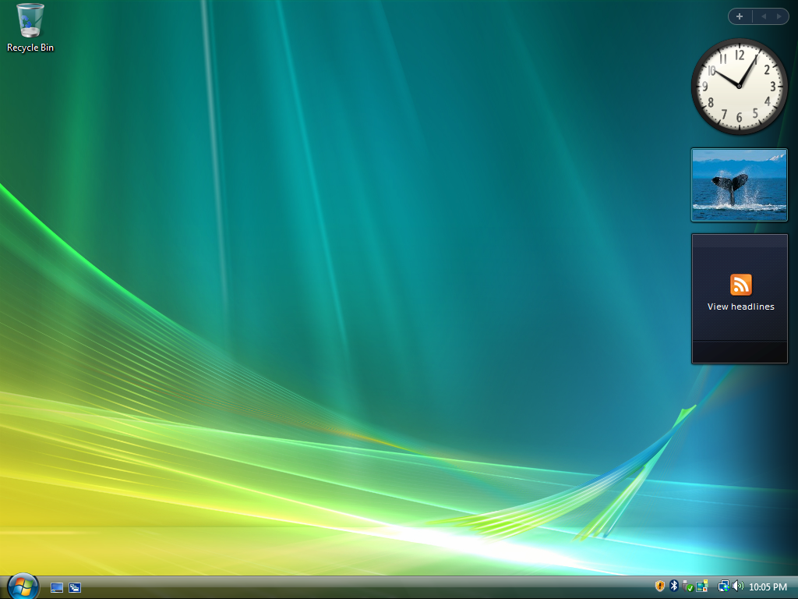
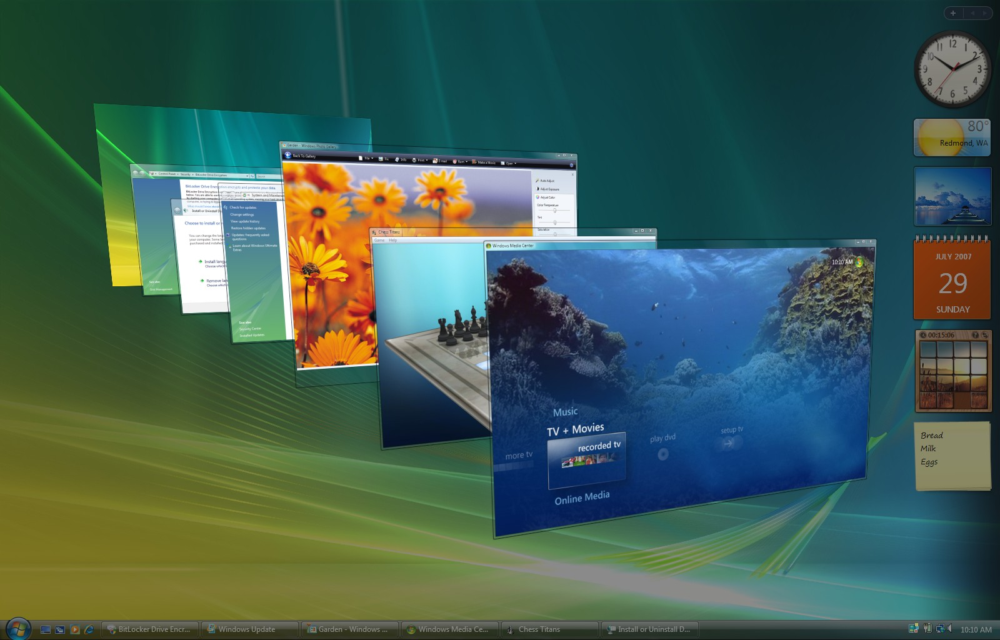
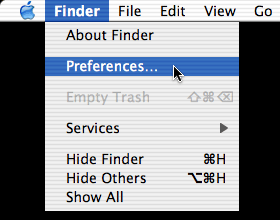
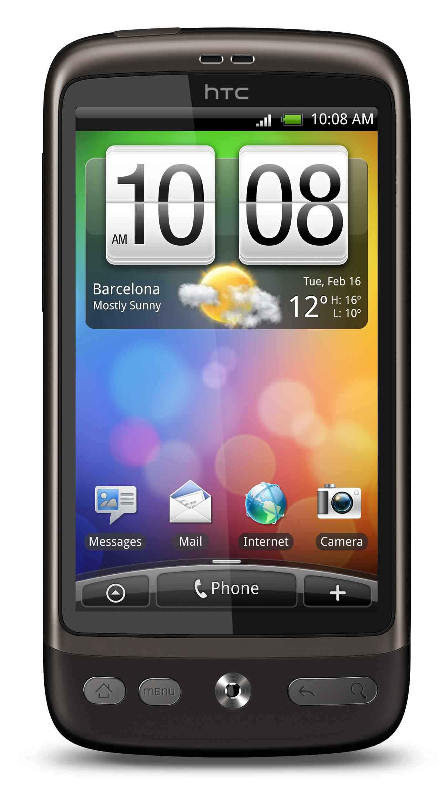
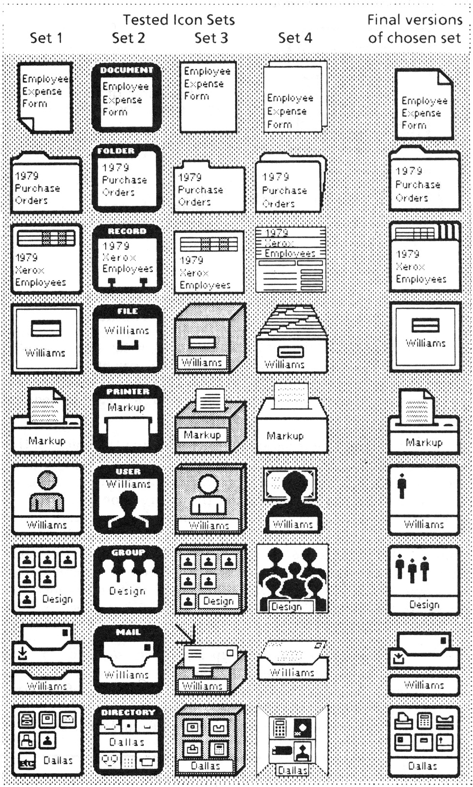
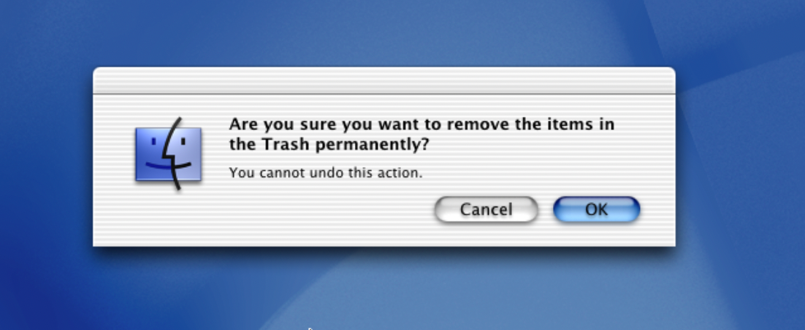
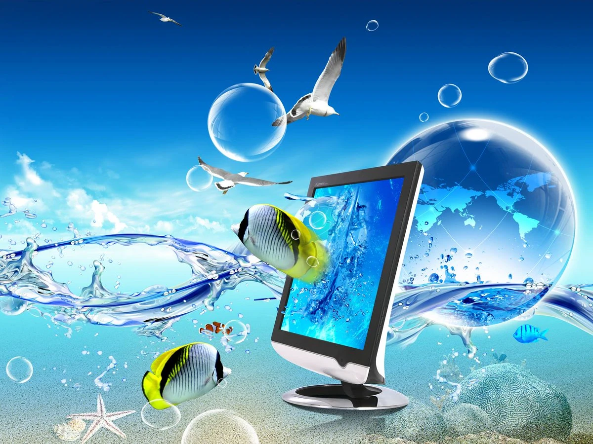

# Designing with the Familiar:
### The Persistence of skeuomorphism in Interface Design

# Abstract (W-I-P)
This Master Thesis examines the role of skeuomorphism in graphical user interface design (GUI) through history from the Xerox Alto to the Apple Vision Pro, and it's impact on today's graphical user interface design. Incorporating evidence from qualitative interviews, user testing and survey data, and by analyzing key historical cases like Windows Aero, MacOS's Aqua, early iOS and Android Skins, this study demonstrates that core principles of familiarity, affordance and metaphor remain fundamental to human-computer interaction.

This research also explores how nostalgia for early digital skeuomorphic interfaces is an influence to current design preferences and perceptions, particularly among Gen Z who associate skeuomorphic elements with an optimistic technological future, that never happened. With the recent advent of AR and VR computers, we're seing an emergence of old key skeuomorphic and material design elements that make up these new type of GUIs.

Finally, this thesis reconceptualizes skeuomorphism not just as a historical design trend, but as an enduring approach to creating intuitive and emotionally resonant human-computer interfaces.

# Foreword
I've always been curious and interested of graphical user interfaces. At the age of 10, I remember using PowerPoint to design user interfaces for my old bulky HP laptop and later for my first smartphone (Samsung Galaxy Young). I was enthusiastic reimagining new interaction experiences.

At the age of 11, I began developing utilitarian software like web browsers, media players and file downloaders using the C# coding language on Windows, by following YouTube tutorials. I then started thinking about the design part of these apps, how can I make them pretty and usable? how can I make them interesting? how can I make them intuitive for their users? how can I make them stand out and be different from what the tech giants are making. How can I fluidize interactions.

I also find it fascinating designing interfaces of operating systems, and the point of contact and connection between humans and machines. The portal to other apps, services, tools, while discreet have to be well designed.

# Introduction

## Skeu-what?
As a kid, designing interfaces (for fun) was fun because of the amount of detail and personality you could put into one. There was no limit to creativity and when social media and the web 2.0 was going strong, there was a sense of artistic expression from people through their MySpace accounts, YouTube channels, Facebook, MSN, ... And that mean of expression made its way to the corporate world, starting first with the initial portal to all these 2.0 services; the operating system.

Skeuomorphism is a design approach that uses real-life metaphors to mimic real-world objects. It traces its roots from material objects and artistic movements like Art Nouveau where artists like Hector Guimard imitated organic forms in his Paris metro entrances design, and it was only quoted on computers starting from the 1980s. In graphical user interfaces (GUIs), skeuomorphism manifests itself where elements like buttons, icons, layouts and backgrounds mimic real-world counterparts by using textures, shadows, 3D effects and sounds to enhance realism. One of the most common example that is always given is "the iPhone's old visual interface" that shipped with apps that mimic real life objects like the compass and its varnished wood texture, gold trim, serif fonts and reflections. Anyone opening that app on their iPhone knew exactly what its purpose was.

Familiarity plays a big role with skeuomorphism, as the style was commonly used after the 2000s, just in time for the Web 2.0's expansion. These kind of interfaces leverage people's existing knowledge of physical objects, reducing the learning curve associated with new interfaces and allowing novice users to use without extensive instructions. When discussing skeuomorphic design, it's essential to consider not only visual elements but also sound effects and animations that also reflect this idea of transferring our analog world to the digital one.

## Research Question
It's with that fascination in user interfaces that I wanted to revisit skeuomorphism, maybe out of nostalgia, but more importantly investigate the emotions of people who used these interfaces and what they think of them now. Researchers have already found that there was no winning approach between either flat design nor skeuomorphism, with flat design being more efficient and clear, and skeuomorphism being more aesthetically engaging and intuitive as well as being visually less effective in terms of usability.

Recently, corporations and designers started bringing back elements of skeuomorphism into their interfaces. For example, Airbnb uses a thick red circular slider when selecting dates for reservations, or when clicking on a profile icon that looks like a semi-closed book to see their score and see it open. Airbnb's addition of skeuomorphic cues into its apps was well received on social media by designers and ordinary users and congratulated the company for their courage. Therefore, there is a place where this style is still appreciated. Hence, the question of what role does accessibility and nostalgia play in the persistence of skeuomorphic design principles in modern interface development?

To answer that, I will first introduce a context of what is skeuomorphism through the history of computers and mobile phones, I will analyze cases that I found interesting to showcase different styles of skeuomorphism, I will talk about metaphors and affordances based on the data I collected during my field research, I will talk about the nostalgia aspect and finally I will conclude this thesis by giving clues to what's next in the future and three ideas for a practical project.

# Context

## A small bit of History
In 1973, inside of a small research lab down in Palo Alto, was an all-in-one desktop computer prototype that amazed anyone who had the chance to see it. The few who had the chance to meet this machine, took the main idea and ran with it to create a new generation of personal computers. That computer was the Xerox Alto, imagined at Xerox's PARC, and considered by many the first computer to feature a graphical user interface, fundamentaly transforming human-computer interaction (Bardini, 2000; Moggridge, 2007).

A GUI (Graphical User Interface) is an interface between a user and a computer that employs a series of visual codes to display information and allow interaction; buttons, windows, icons. Before GUIs, users relied on the CLI (command line interface) which required typing text commands on a black screen. This meant users were forced to learn and know specific text commands by heart to perform any operation. With a GUI, you didn't need to learn commands as you could see them all on a screen if you wanted and execute them in a click. Talking about clicks, the Xerox Alto was the first computer that shipped with a mouse as an interaction method on the screen.

Using common language, the portrait monitor displays text, small icons and allowed the use of multiple programs at the same time, in what was called the Desktop, just like the one at work, with items on it. The Alto is the first computer to use a WYSIWYG, What You See Is What You Get, text editor and bitmap display, meaning that you could print exactly what was displayed on the screen (Smith & Alexander, 1988).

Steve Jobs (Apple Computer, 1976) and Bill Gates (Microsoft, 1975) both visited PARC and went on to copy the idea for their respective software, with Apple unveiling the Lisa in 1983 and the Macintosh in 1984. As for Microsoft, the first version of the Windows OS, operating system, was announced in 1983 as a GUI add-on for MS-DOS, but later came out as a standalone OS in 1985 and was licensed by PC manufacturers, mainly IBM (Campbell-Kelly & Aspray, 2004).

In 1988, Apple filed a lawsuit against Microsoft and Hewlett-Packard for using visual GUI elements similar to Apple's Lisa and Macintosh OSs. Seeing this lawsuit, Xerox also filed one against Apple alleging that the Macintosh's GUI was heavily based on the Xerox Alto's OS. These lawsuits highlight two crucial aspects of early GUI development: first, the immense commercial value that companies placed on interface design, and second, the complex nature of innovations in GUI design, where improvements are most of the time built upon existing ideas.
After 4 years and an unsuccessful appeal to the Supreme Court, the United States Court of Appeals for the Ninth Circuit dismissed the case in Apple Computer, Inc. v. Microsoft Corp. (35 F.3d 1435, 9th Cir. 1994), claiming that "Apple cannot get patent-like protection for the idea of a graphical user interface, or the idea of a desktop metaphor which concededly came from Xerox. It can, and did, put those ideas together creatively with animation, overlapping windows, and well-designed icons; but it licensed the visual displays which resulted."

This legal battle also marked a turning point in how software interfaces were viewed as intellectual property, and by preventing companies from monopolising basic GUI concepts like the desktop metaphor, making these fundamental interface elements open to widespread innovation. This opened the door to a proliferation of GUI-based operating systems in the 1990s: Microsoft Windows became the dominant PC interface, while various Linux distributions like Ubuntu (Shuttleworth, 2004) and Red Hat (Ewing, 1994) created their own GUI interpretations. Open source developers started writing new desktop environments like Gnome (Icaza & Mena, 1997) and KDE (Ettrich, 1996) providing Linux users with modern, user-friendly interfaces comparable to Windows and Mac OS, while maintaining and promoting the principles of open source software. Even IBM's OS/2 adopted similar desktop principles. This democratization of interface design coincided with and accelerated the personal computer revolution, as manufacturers could now create familiar, user-friendly systems without worrying about legal repercussions. With features like windows, icons and folders, the desktop metaphor had become a universal standard and familiar to the millions of new novice users by the mid-1990s.

At the 2000 Macworld Conference and Expo in San Francisco, Steve Jobs (Apple Computer CEO) announced a complete reengineering and redesign of MacOS calling it MacOS X (or 10). A new base and architecture, that comes with a new design language called Aqua. During the event, Jobs stated that "it's liquid, one of the design goals was when you saw it you wanted to lick it" (Steve Jobs, 2000). Breaking up from the gray, pixelated and static design of the 1990s, Aqua was about droplet-like components, reflections, translucency, depth and life-like material textures.

This move started a new trend, for a new decade. Aqua was possible thanks to advancements in technologies like improved processor speeds and more importantly GPUs that allowed the display of life-like shadows, three dimension effects, animations and better anti-aliasing fonts; gone were the old grey screens on computers! This aesthetic revolution spread far beyond Apple: Microsoft followed suit with Windows XP in 2001, introducing its colorful "Luna" interface, while Windows Vista (despite its troubled development as "Longhorn") pushed even further with the transparent "Aero" design in 2006. The trend influenced software developers too - Adobe redesigned its Creative Suite with glossy interfaces, web browsers like Firefox and Opera adopted similar visual styles, and even open-source software like OpenOffice updated its appearance to conform to these contemporary norms. This visual evolution extended to the web, where CSS3 and new JavaScript capabilities allowed websites to use shadows, animations and gradients to replicate these desktop aesthetics. This "glossy" design language had become the de facto standard across all digital interfaces by the late 2000s, from media players like Winamp and iTunes to instant messaging clients like MSN Messenger and Yahoo Messenger.

But before the 2010s ended, Apple unveiled it's most successful device after the Macintosh, based on MacOS X's design language; the iPhone. Although not being the first smartphone, it brought a lot of the desktop's early skeuomorphism language to the pocket, with a finger-friendly touch interface but also a rethinking of mobile phone interactions. In 2007, the landscape of mobile phones was pretty crowded. Many manufacturers were fighting in a booming market with clunky, slow, unresponsive and not touch friendly phones, until Apple came and proposed a vision of what smartphones should be. This vision was later taken by multiple manufacturers and made it their own for the years to come, leading to a wide spectrum of skeuomorphic mobile GUIs, from Google, Samsung, HTC, Motorola and others all creating different looks on top of the Android OS.

In 2006, Microsoft released the Zune, an mp3 player created to take on the Apple iPod. The Zune was different, and made use of lowercase typography, a grid and monochromatic font colors. But Microsoft only went full Flat Design on it's modern new mobile OS, Windows Phone 7, bringing a fresh take on mobile GUIs and differentiating themselves from the competition, fully breaking up from the Skeuomorphic 3D visual style they've called Windows Aero. Windows Phone 7 was considered a breathe of fresh air by people as the skeuomorphism Spectrum was beginning to become crowded. Microsoft named its visual style Metro (before changing its name because of a lawsuit). Metro, and flat design, is based on the design principles of the Swiss Design style; clear typography, large texts, simplicity and was considered more artistic in a way. The interactivity part was also important as motion played a bigger role, all while being simple. This was the first attempt at a flat design GUI.

In 2013, Apple announced it's 7th major version of the iPhone OS, iOS 7, that completely strips away the Skeuomorphic Design Language for a more Flat and Flashy Design Philosophy, with other manufacturers following on the trend.

Flat Design became the norm, providing clear, simple and efficient design to designers and app developers. It was a breathe of fresh air in general, and everything that came out using a skeuomorphic visual style at the time was considered out of date. Apple followed for MacOS X on 2014 by incorporating flat design elements from iOS 7. Starting by removing years of skeuomorphic design elements across both operating systems, and then by 

That is until the 2017 when Microsoft revived the movement announcing the Fluent Design System focusing on five key principles; Light, Depth, Motion, Material and Scale. But at the time, it was only an evolution of Microsoft's flat design that was also pushed by the release of their mixed-reality headset, Hololens. Interacting in space has to feel 3D, and flat design was just not made for that.

In 2020, Apple announced a new version for its Mac OS (Big Sur), reconciling with skeuomorphism or a smart part of it by launching new icons and interfaces. Recently in 2024, iOS also received small hints of skeuomorphism through some parts of the OS and its apps. Microsoft followed with Windows 11 by bringing a rounder and fresher design.

In 2023, Apple announced a mixed-reality headset called the Vision Pro and claimed that  "The era of spatial computing is here". Using codes of the desktop metaphor, you could interact with your hands just like any other VR or AR headset. Spacial computing represents the latest evolution in GUI design, and operating systems like Apple's VisionOS, Microsoft's Windows Mixed Reality OS, or even Google's GlassOS try to challenge and reinvent the post-smartphone and post-laptop computing experience.

## Methodology
By mixing qualitative, quantitative surveys and interviews, I wanted to know how ordinary users think and experience skeuomorphism in user interfaces. Understanding how people receive and feel interfaces they use everyday is essential to create more intuitive and user-friendly designs that reduce friction as much as possible. Because we as designers design interfaces for people, not for us, and we solve problems like reducing barriers.

I started interviewing and user-testing people (both ordinary users and designers) for an hour, where we went back in time and used old technologies from more than ten years ago! I selected 5 people around my age, from 20 to 26 who tried and tested all these devices for more than an hour. Apart from that, I went on to post a survey on some Reddit groups, like r/FrutigerAero, to gather insights and references from people.

The interviews I first conducted consisted of asking people about their knowledge of skeuomorphism, explaining it, comparing it to Flat Design, asking their opinion on both design styles and finally enquire them about their ideas for future GUIs or UIs in general. The pre-user tests questions looked something like "Are you familiar with Skeuomorphism?", "Do you remember what feeling(s) you remember when experiencing a specific device?", "Can you rate Skeuomorphism on a scale of 1 to 10?", and many more.
These interviews were conducted at the school's library during summer, where I laid multiple diverse electronic devices a on a table. The devices were carefully chosen to be the most representative of the 2000s to 2010s era and were composed of two laptops and three smartphones, displaying a range of skeuomorphic graphical user interfaces. I call it *The Spectrum of Skeuomorphic GUIs*.
The next step was to make them choose one device from the table, turn it on and use it until they want to go to another one. While they're using it, I'm asking questions and guiding them to open apps like Calendar, Notes, Media Player, etc. All while prompting them for reactions and emotions.

# Cases
In this chapter, I will analyze five different operating systems that marked the 2010s era, especially the last remnants of what we call skeuomorphism and what can be considered peak skeuomorphism.
For each case, I will describe and analyze Visuals, Acoustics and Motion settings of each, and will also describe how people used these interfaces at the same time.

PROBLEMATISER,EN QUOI LE skeuomorphismE REFORMULE L'UTILISABILITé?
Mettre mes observations dans ces sous parties.

## Windows Aero
Developer: Microsoft
Period: 2005-2012

Introduced with Windows Vista in 2005, Aero was a complete redesign of the Windows interface, replacing Windows XP's Luna theme. According to Microsoft, Aero stands for "Authentic, Energetic, Reflective and Open" and goes way beyond what Luna achieved, in terms of visuals, performance and animations.

### Visuals
People who used this OS, felt it was so glossy and looked shiny. They felt that the glossy and transparency elements gave the UI a light look to it. The most visible element on a desktop OS is the wallpaper, and the default wallpaper that comes with Vista references the northern lights. This can be considered skeuomorphism, in a way, of employees view of auroras from Microsoft's headquarters in Redmond, USA (ref. Jenny Lam), connecting to the physical world. The default wallpaper wasn't just decorative, it established Aero's design language of ethereal light and transparency that permeated the entire interface, creating a cohesive environment that suggested high-tech sophistication.

And then comes the Desktop UI elements like the taskbar at the bottom, the icons all over the wallpaper and the widgets on the right.
The taskbar looks shiny with its dark and glossy look. The Windows button all the way to the left has this glow to it that resembles a real button. And when you press it, it glows brighter signalling a feedback to the user, just like a real button.

When opening windows and programs, most of the time the title bar is translucent, giving the impression that windows are slabs of glass. Putting windows on top of other windows shows the translucency and blur that is happening. Just like putting many slabs of glass on top of each other, visually mimicking house windows. There was also a subtle reflective highlight along the edges suggesting polished glass.

Shadows also play an important role in creating a realistic depth perception to windows and make them appear floating on the desktop. Today, we take that for granted, but shadows were heavy on performance, as with the blur and translucency effect. This is eventually what led to the initial mixed reception of Windows Vista, as it had problems running on computers of the time.

With this new visual style came a new typography that was designed especially for this new era. Developed by Steve Matteson at Monotype, Segoe replaces Franklin Gothic and Tahoma that Microsoft was using for its branding and UI. This new typeface characterizes itself as a humanist font family (Based on the VoxATypI classification). Segoe also worked great on the brand new LCD displays of the time, but more importantly it softened the technical nature of the interface while maintaining clarity.

### Acoustics
Outside of the trash bin sound when it's emptied, Aero brings many high quality sounds. From the startup sound to the email notification sound. The audio cues of the new sounds are more softer than Windows XP's literal ones. The new startup sound was a gentle, crystalline chord progression.
These new sounds sound more synthetic, magical, glassy and dreamy, immersing the users into the magical world of personal computing.

### Motion
The Windows OS has been very static throughout its early years, and with this new design language came a new way of animating interface elements. Opening programs and closing them was animated with a fade in and fade out for example, rather than appearing/disappearing instantly. Maximizing and minimizing windows also showed smooth scaling and transitioning.

There also was a new feature called 3D Flip that allowed you to see a three-dimentional stack of your open windows that could be rotated through, giving a sci-fi/holographic way of seeing the desktop with an impression of control and power over the computer.

## MacOS Aqua
Developer: Apple Computer
Period: 2000-2014 (2020)

Introduced with the tenth version of Mac OS in 2000, Aqua was also a complete redesign of the MacOS interface. It was originally based on water and evolved into a more discreet visual style. The first version of Mac OS X was all blue and was later tuned down as it evolved through Apple’s different design phases.

### Visuals
During the announcement of this new version of Mac OS, Steve Jobs promised "killer graphics".
Aqua featured new icons that looked just like real-life objects, that were different from what was already seen. The Mail app icon was a postage stamp, the Settings app icon was a switch on a board (before moving to gears, a metaphor of machinery and engineering), etc. Nothing really new from what icons looked like before, but this was the first time that icons were in high definition and looked 3D, compared to illustrations or vectors. There was a big work on shapes, lightning and textures.

The dock, Aqua's most iconic new element, featured glossy three-dimensional icons that appeared to float on a board. It's only until Mac OS X 10.5, that Apple redesigned the dock into a reflective table-like surface, mimicking objects reflected on water.

But one of the most iconic elements of Aqua were buttons. Although inspired by water, appeared as glossy gel capsules that seemed to contain actual liquid, that appeared to depress when clicked.

Scrollbars and progress bars were funny, as they used the same effect found in barber poles; a stripped candy-cane pattern that moves behind transparent glass, creating an illusion of depth and movement.

Some apps's backgrounds use real-world material metallic textures, like the QuickTime 5 video player and iTunes. It uses a brushed aluminum texture all around, that later pushed itself to the entire operating system and later the iPhone.

Speaking of texture, early versions of Mac OS X had a pinstripe texture that can be seen throughout the entire OS. Each new version  of the OS will bring more and more skeuomorphic design elements, until Apple started incorporating elements of flat design.

Some of the most famous ones were the Notes app with its yellow paper and torn paper at the top bellow the title bar, the Contacts app with it's book sized window and visible binding. Real-life objects making their way to GUIs and being serious about them wasn't really frequent.

The new iMac G4 came out in 2002 with this new version of the Mac OS. It featured a clean design that let the UI speak for itself, compared to the previous generation that had a colourful range. And the UI being that texture, gave the illusion that people were interacting with real object and materials, erasing the fact that the computer was an electric device computing zeros and ones.

### Acoustics
Speaking of sounds, Aqua brings so many new high quality sounds, from the start chime that suggested the system coming to life with its harmonious chord, to the UI sounds that all felt material like the drag and drop sounds that mimicked physical objects manipulation or the error sounds that uses musical tones rather than attention-jaring sound effects.

### Motion
Aqua brings so many new system wide animations. Icons bounce when loading from the dock, windows are squeezed into the app icon's on the dock when minimized and reopened (Genie Effect, that is still present to this day!), Magnification of the dock, ...

When clicking on app icons on the dock, they would bounce playfully, creating a sense of physical response to touch just like when dropping something on water, and suggesting physical energy and momentum. And when removing apps from the dock, a dissipating vapor is animated.

## iPhoneOS
Developer: Apple Computer
Period: 2007-2013

In 2007, Apple shook the world by announcing their take on the mobile phone. The iPhone had a distinct industrial style; it looked simple, minimalist and fancy compared to other mobiles at the same time. It brought a distinctive design that was about to inspire many other companies for the years to come and created a new category of personal devices.

### Visuals
Based on MacOS X, iOS (initially known as iPhoneOS) inherited lots of design cues from its desktop counterpart, all while having its own aesthetic and user experience. The iPhone was the first device that embraced many, and extreme, skeuomorphic principles in its user interface. The GUI used a grid of 4 by 4 icons to display apps on the home screen. Swiping left or right revealed the next page of installed apps.

Apps looked sharp, glossy and kind of out of this world, but at the same time replicating real-world elements. The giant display made it so that the GUI stands for itself. The homescreen layout with apps on a grid was something really new. With each icon having a detailed symbolization of its functionality. When opening apps, they literally open by scaling up its icon, something that other mobile phones didn't do and user no transitions because of how software and hardware heavy they were.

Apple's Notes app on the iPhone looked like its macOS counterpart, although the later came in 2012, way after the iPhone when Apple implemented cues of its iOS into macOS. When the iPad came, the app took advantage of the whole display.

The app UI featured leather, stiches, paper textures that made the iPad look like a notebook. The icons looked handdrawn, and when selecting a note, a red circle was drawn on the note's title in the side bar.

Other apps featured similar metaphors like the Voice Memo app, having a big detailed microphone at the center of the screen. The camera app featured the look and feel of digital cameras. The Compass app really looked like a sailor's compass, with detailed metal structures. The Clock app displayed an analog clock face with realistic shadows and reflections. Finally, Game Center, although being a social app for connecting players in iOS games, had a poker table texture.

One of the iconic designs of the skeuomorphic iOS era is the calculator app, as it seems to replicate Dieter Rams's design for the Braun ET66, where it used rounded beveled buttons that appeared pressable.

Switches controls also looked like physical toggles that mimicked physical switches, and the on-screen keyboard also featured shadows underneath each key mimicking physical keyboard keys. iOS got the same textures of paper, fabric, metal and realistic lightning for its interface suggesting three-dimensional depth.

### Acoustics
One of the most known iPhone ringtone is Marimba, xylophones playing a chime. The sounds also feel really material, from the ringtones to the system effects, it feels like real instruments or noise-making devices play the sounds. When typing on the keyboard, the click that is heard is reminiscent of mechanical keyboards key presses. The lock/unlock sound also suggested a physical locking mechanism.

### Motion
Because of how new this type of multitouch interface was, Apple had to make animations for people to understand what was happening in the palm of their hand. When you tap an app, it scales to the screen to reveal the app, and when you close it the UI gets smaller and scales back to the app icon. Today, that kind of interaction feels normal, but back then the majority of phones didn't use transitions because it was gimmicky and took too much power. Apple's animations on the first iPhone were slow, just to show first time users how apps "open" at the touch of their icon, compared to opening apps with a capacitive display or T9 keys.

Lists had momentum scrolling and bounce effects that mimicked physical objects, when pressing the home button it would cause apps to shrink back into their icons and deletions and reorganizations of icons had springy animations suggesting physical movement.

## Android Skins
Developer: Google, Samsung, HTC, etc.
Period: 2008-2013

It wasn't until 2008 that the first third-party manufacturers, HTC, announced their first Android powered mobile phone. After that, many other manufacturers felt the need to jump on the smartphone train and take their part of the cake. Android is an open-source software, and manufacturers can develop their own look and feel. So naturally, not every Android phone has the same UI design. For this case, I will analyze Android Skins in general and not specific to each manufacturers. 

### Visuals
Phone manufacturers were all making smartphones before, but when apple unveiled the clean and minimalist UI of the iPhone, they really started taking notes on how they can make their interfaces more skeuomorphic, especially on touch screens. By using Android, manufacturers also had extensive skinning possibilities to match their respective branding and styles. Each manufacturers tried to create a unique identity and had different interpretation of what a mobile interface should look like, all while staying in the same "grid of apps on a wallpaper" style.

Samsung who was already making phones jumped on Android and designed their Look and Feel UI called TouchWiz. And in 2011, they were sued by Apple over patent infringement, in one of the most known intellectual property and patent fights in tech history. Apple and other manufacturers fought on multiple patents, but the Apple vs Samsung is the most known one, as multiple documents were published and shared to the public.

The trial concerned three things: the front and rear look of the iPhone and finally the GUI showing the layout of apps on its homescreen. Apple arguied that Samsung stole the home screen design of Apple's iOS. By evolving its UI, Samsung also used heavy skeuomorphic elements (gradients, shadows, textures) with nature inspired themes like water droplets.

Google's own version of stock Android featured a Tron-like aesthetic with electric blue accents and black backgrounds while using holographic effects that suggested technological advancements and futuristic interfaces. Google's UI was cleaner and minimalist compared to Samsung's, HTC's, or any manufacturers colored and detailed designs in the asian market.

Meanwhile, HTC really went for super realistic animations and effects, like weather animations on the home screen (rain drops on screen, thunder) and feature sophisticated transparency effects. When switching between screens, you could also set custom animations (like a three-dimension cube spin) rather than just sliding left or right.

With time, the skins evolved to interfaces eventually being influenced by Google's Material Design.

### Acoustics
Each manufacturers developed their own sounds to fit their branding and style. For example, Google's original sounds were futuristic with robot-like sounds. Samsung on the other hand used nature-inspired sounds like water drops and bird chirps with orchestral notification sounds. And finally, HTC used premium-feeling mechanical sounds with realistic environmental sounds.

### Motion
Android skins all featured extravagant animations like 3D rotation effects, bouncy animations, water ripple effects and so much more that made each skin look like an upgraded iPhone. Something that ultimately had performance problems with smartphones of the time.

## Windows Phone
Developer: Microsoft
Period: 2010-2020

Honorable mention: I wanted to talk about Windows Phone, the forgotten mobile operating system that "didn't have apps". Windows Phone was a modern successor of Windows Mobile (2000-2013), that positioned itself as an alternative to the two other mobiles OSs already on the market, iOS and Android. Rather than embracing skeuomorphism, Windows Phone pioneered a flat, minimalist aesthetic that would later influence the industry.

### Visually
Inspired by the Swiss Design Style, Metro emphasized clean typography, dimensional layouts and a focus on content over form. The GUI felt fluid and responsive to the finger's touch. The home screen differed from iOS and Android with the use of squares as apps, on a grid of two horizontally, and you could scroll vertically, up or down to see the rest (and not horizontally like the other mobiles OSs). Icons were monochrome, and the main color on the screen was your chosen color. Windows Phone was so personalizable, it went the opposite way of what GUIs were like; minimalism, frutiger-like fonts, monochrome, focus on typography...

### Acoustics
System sounds were clean, minimalist tones that were subtle, almost imperceptible chimes to avoid disruption. The sounds were more utilitarian, as content was more important.

### Motion
Windows Phone was all motion, but never complicated animations. Transitions between screens and apps used simple fades and slides. In contrast to other platforms, Windows Phone's animations were intended to be responsive and intuitive rather than drawing attention to themselves.

# Usability and Accessibility

## Metaphors
In the 1980 and 1990s, metaphors were being discussed in Human Computer Interaction as a way of democratizing computers by using words everyone knew, mainly in business environments; the desktop, is the space on the screen, has files and folders on it that can be positioned anywhere, the trash bin stands on the desktop and looks like a litteral trash bin, ... A reason for that was that computers were initially work equipment in the 80s. But then, these aspects were also words everyone already got the concept of.

Metaphors also benefit from mimeticism, as lots of icons and layouts mimic their real life counterparts. The icons designed for the Xerox Alto give a really bold business setting through its UI, with cabinet files, mail baskets, folders, ... because computers were business machines.

Apple won't ask Susan Kare to design icons for the first Apple computer with a GUI (Apple Lisa), but will ask her to design icons and typefaces for the upcoming Macintosh. Kare will kick start the icon design job, by illustrating programs and tools by an image. The icons ditched the mega-business style for a more friendly and more appealing visual style.

Although these icons were relatively new and user friendly, people sometime mistook them for other messages, like the dialog that shows up when any program crashes. People saw a bomb and kept calling Apple complaining that their computer was about to explode.

Today, it seems like we're still living in the 1970s original desktop metaphor; the wallpaper, paper bin, icons, etc. When user testing computer GUIs to people, one of the most recurring phrase was that the can easily navigate the old machines because of how the interfaces barely changed. Visually, a lot has changed but in terms of user experience it's still the same. It feels like we're stuck in that metaphor, that kind of works, but the personal computer wasn't only used to do work related stuff since the WWW's creation.

Can we reinvent the personal computer GUI? Microsoft tried in 1995 by releasing Microsoft Bob, a software program designed to replace the desktop of Windows 3.1 and 95 with the goal of offering a more user-friendly and easy-to-understand cartoonish interface than what Windows came with. Its goal was to make Windows more accessible to everyone.

A more contemporary project can be the MercuryOS, a GUI project by Jason Yuan, playing with a speculative vision of the operating system ditching the traditional desktop metaphor.

Mobile-wise, by incorporating metaphors on the iPhone, Apple wanted to make the first experience of the device as easy and seamless as possible for people who never used a phone.
After the flat design period, we've seen less and less metaphors on mobile UIs.

Some courageous people also ditch the GUI entirely by only using the CLI on their computers.

If we come back to the cases I analyzed, you can feel that skeuomorphism also helped people understand the technical aspect of computers and smartphones. DVD drives, files, camera, saving files, etc. All these today feel obsolete in regards to their technology status, but also feel like relics of the past because of how GUIs evolved. For example, when taking a picture, you immediately see the picture in your photos gallery. Compared to 15 years ago, you had to wait for the camera app after pressing the (skeuomorphic) capture button to tell you the image has been saved but only after a few seconds. This explicitly showed, and was interpreted in the way that the image was being captured, just like a physical photo camera. Especially with the shutter sound and the camera's screen showing a sensor closing down circularly to the center.

## Affordances
"See that door handle? How do you know you have to pull it?"
"Do you see the up and down button on the blind's remote? How do you know you have to press them?"

After explaining the concept of Affordances to the people I interviewed, many attested, without me asking, that phones and computers they use today have lost some affordances in their respective user interfaces. I couldn't disagree with them as multiple studies show that skeuomorphism was winning in terms of accessibility and usability.

Affordances are pretty straight forward for buttons. Because of how styled they are with a drop down shadow underneath and the reflections of light on their surface, they appear to act as unitary objects, and they only afford pressing. Although that only works on Skeuomorphic Buttons.

This is the reason flat design is not appreciated for its accessibility means. A flat button is literally flat and doesn't have any shadow or reflection. It sure makes an interface with many buttons cleaner, stylish and pretty, but at the sacrifice of accessibility in knowing what buttons can be pressed in a GUI for example.

And you can see that in all of the other aspects of GUIs, outside of buttons. Scrollbars, titlebars, icons, docks/taskbars, all use the same codes.

Shadows on windows are also another important way of hinting at an affordance. By giving a long shadow to a bigger object like a window makes it look like its floating on the desktop, and makes it afford moving. Of course, that affordance is the result of the title bar affordance. In the first Macintosh OS, the title bar had a pinstripe texture that afforded grabbing in order to move the window.

Today, we don't see this big title bar difference in texture from the window because of how this interaction gesture became the norm and people got used to clicking and dragging the top of any window.

But how do you make current user interfaces intuitive when "everyone gets it now"? Same as the metaphors? How do new generations tackle interactions with tech devices?

Scroll bars are also interesting, Gaver (1991) talks and compares the early Macintosh GUI to the Xerox Smalltalk GUI where he says that "dragging is a natural progression of grabbing". We see less and less of wrong affordances in today's UIs.

According to Gaver (1991) When one affordance leads to the discovery of another, it is called a sequential affordance. In the functioning of a sequence, these types of affordances can be thought of as progressive discoveries where each interaction reveals the next possible action. One example would be the trash bin (again), where the initial affordance has to do with the icon suggesting it can hold deleted items, the second affordance is when the bin is filled and suggests it can be emptied, and the final affordance is when the emptying action triggers the sound effect, completing the sequence. Because of the impact of flat design, sequential affordances have adapted with the touch aspect of interfaces but also declutter and reduction, as users have adapted to new technologies and don't need explicit affordances, but rely on their learned behaviors. Other examples include hovering on a window's corner to reveal the resizing functionality, or clicking on a folder revealing the fact that it can be opened.

When emptying my mac's bin, I was actually surprised to hear a clear sound of the throwing trash sound effect. I deleted some files again to rehear the sound, and was really impressed by the high quality and fidelity of the sound composition. When deleting a file, the sound of crushing paper is played, and when you empty the recycle bin, the sound of crushing paper and the metalic door closing is heard. This is not new as it started towards the end of the 1990s when computers got better soundcards, but what surprised me was that this sound is still present on computers to this day! Sounds that mimic their real life counterparts are interesting, as they make interactions feel physical, just as user interfaces, but with the use of sound effects, mimicking real life sounds and objects. Sending an email triggers the whoosh sound, so you feel like your letter literally travels by air to their recipient.

But in recent years, GUIs became silent leaving some place to smartphones. Tapping keys, receiving a call, sending an SMS, mobile phones always had sounds that each manufacturers conceived to fit their branding. The iPhone brought high quality sounds that felt material and you're directly confronted with that when you unlock the phone, triggering an lock opening sound that makes you think the phone was in fact really locked! Plugging your charger also makes a sound that kind of says "Your phone is plugged, the electricity is flowing". That theme could be another thesis by its own, as people can also have different views and perceptions to the sounds.

To end this chapter, let's not forget that the actual perception of affordances will be determined in part by the observer's culture, social setting, experience and intentions. (ref. William Gaver). Designing user interfaces for a Western market is so different than designing user interfaces for the Japanese market for example. When looking at Japanese user interfaces, westerners can see cluttered interfaces that feel overwhelming.

# Nostalgia
## Simpler Times
We tend to think that "Before, things were always better", can that be true in the case of UI design? During my user tests, a person I interviewed found the iPhone 5's Settings app to be so uncluttered and simple compared to today's version, that it felt empty. It seems that user interfaces have gotten so complicated with time, all while getting flatter visually; "An abstract thing like software was just more easier when everything resembled real world objects". Unlocking my iPhone and opening the settings app, I found myself overwhelmed by the amount of settings, colors and texts. Although we have so many functionalities because of these OSs age and improvements that came with it, we probably have too much choice and features that we probably don't fully utilize.

The tactile and tangible feel of these skeuomorphic GUIs calls upon our brain's understanding of physical affordances, as familiar interfaces help and comfort users into transitioning to new technologies without tension, easing their cognitive load (Don Norman, 2013). But is this nostalgia for skeuomorphism part of a desire to hold onto these "simpler times" with technology changing rapidly.

Operating systems eventually became so complex with a multitude of features and functions that creating a new operating system and specific GUI from scratch today can't be simple task. According to the research done by Schwartz (2005) when people have so many options and features, it can lead to them getting overwhelmed. With multiple choices comes the difficulty of making a choice, it could also lead to regret and anxiety as to doing the wrong action, but having less choice often makes users dissatisfied with their final decision.

But we should also never forget that these simple times we're talking about had tech devices with limited functionality, usability problems and technical restraints. All of that without talking about the learning curves people had to deal with that has since been forgotten.

## Legacy
We've been through skeuomorphism and switched to Flat Design because of how cluttered and kitsch everyday user interfaces became, but also because of the explosion of app marketplaces with developers all bringing their apps with their own style and take on skeuomorphism which led to visual saturation. Flat Design seemed like a solution to that problem, by stripping away all details, textures, 3D effects, and any other visual "pollution". 

Recently, the resurgence of 3D in UI design really challenged our Flat Design saturation by bringing something new, breaking away from the flat and minimalist looks but maintaining a sense of restraint on exaggeration. skeuomorphism lives on, but differently.

One attempt at that was Neumorphism, that focused on introducing subtle skeuomorphic elements. This style had big problems like having low contrasts and bad clickability detection causing bad reception; this style never made it mainstream and was just fancy/another good looking concept that is not applicable to real-world usage.

But this new Glassmorphism or whatever we should call it is interesting. It brings back depth to the interfaces, breaking up with flat design principles like flat surfaces, or minimalist icons to cite a few. This can be considered as a direct descendant of the skeuomorphism UI style we know.

Some designers even design UIs that are not made to be functional but are more reinterpretation works of art, devoted to waking emotions and feelings up from people, considered design as an artistic expression, with a touch of nostalgic reinterpretations. Some designers also enjoy redesigning current user interfaces if flat design never went mainstream.

Finally, skeuomorphism's legacy can also be considered sociological thanks to one of the most fascinating design styles of the 2000s and its naming; Frutiger Aero.

## An Unrealized Future
Frutiger Aero is a broad design style and aesthetic attributed to the post Y2K era, that can be found in advertising, media, technology. Invented by Sofi Lee, the name Frutiger Aero is named after the famous typeface designer Adrian Frutiger (creator of the famous and copied Frutiger humanist typeface) and Windows Aero (the GUI of Windows Vista and 7). And according to the Aesthetics Wiki, it is sometimes referenced as Web 2.0 Gloss, and contains many sub-aesthetics and related aesthetics like Frutiger Metro, Technozen, Frutiger Eco and Helvetica Aqua.

This categorization is pretty interesting as it puts a name and a period on a design style that is too soon to be named, compared to other historical design and art time periods. This style became viral in 2022 on social media, especially TikTok, and sparked a subreddit with nearly 70k members, at the time of writing.

According to people who fancy the style, they believe that Frutiger Aero is all about a bright, colorful and peaceful future that was promised to us but never delivered, especially as Gen Z people who grew up with all these graphics that merged nature elements, fluid shapes, floating elements and technology. Humans fantasizing on merging nature and technology expressed it through these designs of what we call Frutiger Aero today.

People I talked with on the internet said that skeuomorphism can be considered a Frutiger Aero sub-style because they overlapped a lot during history, but they are not the same.

I believe that Frutiger Aero is a direct result of nostalgia. As a Gen Z person, I do feel a bit nostalgic because I grew up with these colorful and dynamic design trends, that a big chunk of people from my generation experienced and grew up with. We also understood computers and technology in general through this aesthetic.

# Conclusion
## What's Next?
The post COVID-19 era has been marked by the democratisation of AI in our everyday lives, questioning the future of interface design. Can we rethink the computers and mobiles that surround us? Talk about the hot question everyone is asking, what's after the iPhone?

AR? VR? Apple started incorporating some of it's design elements from the Vision Pro OS into its mobile OS UI. Reusing 3D layouts, More shadows, ...

Can we finally make user interfaces that adapt to us and not the other way around, all while staying intuitive and easy to understand without friction?

## Practical Project
